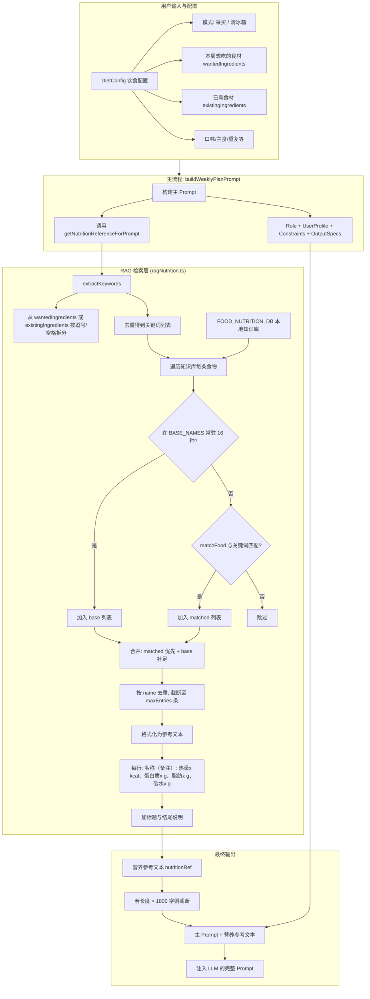

# PRD：AI 极简饮食规划助手 (Legerity)

## 1. 产品概述

| 项目 | 说明 |
|------|------|
| **产品名称** | AI 极简饮食规划助手（Legerity） |
| **定位** | 基于 Google Gemini 的**一周饮食规划 + 采购清单**生成工具，面向健康人群的饮食参考（非医疗） |
| **形态** | PWA 单页应用，支持离线、响应式、可添加到 iOS 主屏 |

---

## 2. 业务背景与用户价值 (Business Value)

### 2.1 痛点描述：为什么传统方式不行？
*   **认知负荷极高**：传统饮食管理需要用户手动查询食材热量并心算配比，门槛极高，极难长期坚持。
*   **静态方案无法落地**：网上的“万能食谱”不考虑用户现有食材，导致食材浪费或额外的采购压力。
*   **缺乏即时反馈**：手动记录与规划之间存在断层，用户无法实时看到“想吃”与“目标”之间的量化平衡。

### 2.2 AI 介入点：为什么非 AI 不可？
*   **非结构化数据处理**：用户输入的“冰箱里剩下的半颗白菜”等非结构化信息，只有 LLM 能理解并转化为结构化食谱。
*   **个性化实时生成**：根据身体指标（BMI/TDEE）和瞬时口味偏好，秒级生成满足营养闭环的 21 顿餐食。
*   **动态约束求解**：在满足热量目标的同时，实现“一材多做”、“控制采购种类”、“忌口过滤”等复杂约束。

---

## 3. 目标用户

- 追求健康、希望控制热量与营养的普通用户  
- 需要「一周吃什么 + 买什么」的决策辅助  
- 有「清冰箱」或「按口味采买」两种典型使用场景  

---

## 4. 核心功能与流程 (Core Flow)

### 4.1 核心功能（一句话）
- **健康数据**：计算 BMI、TDEE、目标热量（减重/减脂/增肌）。
- **双模式规划**：**采买模式**（按口味生成清单）/ **清冰箱模式**（最大化利用库存）。
- **AI 周计划**：生成 7 天三餐 + 聚合清单 + 调料 + 精简做法（每道菜约 3 步）。
- **RAG 增强**：本地营养知识库参与推理，提升分量与搭配合理性。
- **结果使用**：查看/复制方案、查看具体做法弹窗。

### 4.2 关键用户流程
```
首次使用 →  onboarding（身体数据 + 运动水平 + 忌口）→ 保存
                ↓
首页 home → 查看 BMI/TDEE/建议摄入 + 选择本周目标（减重/减脂/增肌）
                ↓
选择模式 → 采买模式 或 清冰箱模式 → 进入 plan_input
                ↓
plan_input → 口味偏好、食材种类上限、是否允许重复、食材说明（想吃/已有）→ 一键生成
                ↓
result → 三餐安排 + 购物清单 + 调料 → 复制 / 查看具体做法 / 重新生成
```

---

## 5. AI 策略设计 (AI Strategy)

### 5.1 Prompt 架构 (基于 LangGPT 结构)
- **Role**: 专业的、精通中西式菜肴的极简营养师。
- **Constraints**: 
    - *营养闭环*：每餐必须包含蛋白质+主食+优质脂肪。
    - *极简采购*：同一食材多做法复用（一材多做），严控采购品种数。
    - *生活化逻辑*：早餐必须符合日常习惯（如粥、奶、蛋），严禁早餐重油重辣。
    - *菜品多样性（强制）*：绝对禁止任意两天（包括相邻或隔天）的早中晚三餐组合完全相同。7天中每天必须是独特的菜品组合，通过烹饪方法变化、搭配组合变化、餐次打散分配来实现多样性。
    - *热量精确性*：每日三餐总热量必须根据实际食材和份量准确计算，不同的食材搭配必定产生不同的总热量值，严禁多天出现相同的每日总热量。
    - *数据一致性*：每日菜谱portion总重量、采购清单shoppingList总重量、菜谱做法recipes总重量必须接近一致（允许±5%误差）。
- **Output Format**: 严格 JSON 输出，包含 `dailyPlans`、`shoppingList`、`seasonings`、`recipes`。

### 5.2 RAG 方案细节
- **关键词提取**：正则拆分用户输入，去重处理。
- **匹配优先级**：用户相关食材 > 基础常驻条目（米饭、鸡蛋、西兰花等 16 种）。
- **数据注入**：每 100g 可食部的量化数据，强制 AI 在计算 `portion` 时有据可依。

#### 5.2.1 RAG 从用户配置到参考文本的完整流程（产品架构示意）



- **数据流**：用户配置 → 关键词提取 → 知识库检索（关键词匹配 + 常驻补全）→ 合并去重截断 → 格式化 → 与主 Prompt 拼接 → 送入 LLM。
- **设计要点**：无向量库、纯关键词+常驻列表，保证响应速度与可控性；RAG 结果作为「可锚定数据」降低 LLM 幻觉。

### 5.3 模型选型
- **主选模型**：`gemini-3-flash-preview`（高性价比、极速响应、支持 JSON Schema 约束）。
- **备选/自定义**：支持 `gpt-4o-mini` 及用户自定义 OpenAI 兼容接口。

---

## 6. 功能要点（必读）

| 模块 | 关键规则/约束 |
|------|----------------|
| **用户画像** | 年龄、性别、身高、体重、运动水平（4 档）、目标（减重/减脂/增肌）、长期忌口；本地持久化 |
| **健康计算** | BMR（Mifflin-St Jeor）→ TDEE → 按目标加减热量；BMI 分类：偏瘦/正常/超重/肥胖 |
| **采买模式** | 可选填「本周想吃的食材」；生成整周购物清单（种类可设上限）；一材多做法、控制品种数 |
| **清冰箱模式** | 必填「已有食材」；清单中已有项可标「(可选/已有)」；最大化利用库存 |
| **AI 约束** | 禁搭配禁忌；少油少盐；早餐符合日常习惯；午餐/晚餐须有主食+菜+蛋白+适量脂肪；portion 与 name 一一对应、单位克/ml；7天菜品组合不得重复；热量准确计算；三个维度总重量一致性校验 |
| **RAG** | 从 `foodNutrition` 按关键词+常驻基础条目检索，格式化后注入 prompt，最多 50 条 |
| **输出结构** | dailyPlans（day + breakfast/lunch/dinner：name, calories, portion）、shoppingList（name, amount）、seasonings、recipes（dishName, steps） |

---

## 7. 技术要点（与产品强相关）

- **前端**：React 19 + TypeScript + Vite 6；Tailwind；PWA（Workbox）。  
- **AI**：Google GenAI (Gemini) / OpenAI SDK，JSON Schema 约束输出。  
- **RAG**：本地 `FOOD_NUTRITION_DB` + `ragNutrition.ts` 关键词匹配，无向量库。  
- **安全**：API Key 通过环境变量或用户自定义设置（本地加密存储），前端不暴露。  

---

## 8. 质量评估与优化 (Eval & Optimization)

### 8.1 评估维度
- **准确性**：AI 生成的总热量与用户 TDEE 目标的偏差率（目标 < 10%）。
- **格式合规率**：JSON 解析失败率（通过 Schema 约束，目前接近 0%）。
- **响应延迟**：从点击生成到展示结果的时间（目标 < 5s）。

### 8.2 Bad Case 闭环
1.  **早餐出现重口味菜品**：新增 `饮食习惯` 约束，明确定义早餐合法范畴。
2.  **清冰箱模式下采购项过多**：引入 `maxIngredients` 约束，并在清单中强制标注 `(可选/已有)`。
3.  **分量描述模糊（如“适量”）**：强制要求 `portion` 字段必须为“菜名+克数”，禁止模糊词汇。4.  **隔天食谱完全重复**（2026-02-22）：在Constraints中新增"菜品多样性（强制）"规则，要求7天中任意两天的三餐组合都不得相同，并在OutputSpecs中增加"菜品去重最终验证"环节，要求AI生成后自查并修正重复。
5.  **每日总热量完全相同**（2026-02-22）：在OutputSpecs中新增"热量要求"章节，强制要求每日热量根据实际食材精确计算，不同搭配必须产生不同热量值，目标热量±10%范围内波动。
6.  **菜谱/清单/做法重量不一致**（2026-02-22）：在OutputSpecs中新增"数据一致性校验"强制规则，要求每日菜谱portion总重量、采购清单shoppingList总重量、菜谱做法recipes总重量必须接近一致（±5%误差），如不一致必须重新计算调整。
7.  **烹饪指南页面移动端体验不佳**（2026-02-22）：调整烹饪指南模态框样式，使用居中显示（items-center）、限制宽度（max-w-md）、统一圆角（rounded-[32px]），与主应用保持一致的移动端体验。
---

## 9. 风险与容错设计 (Risk & Error Handling)

### 9.1 幻觉管理
- **数据锚定**：通过 RAG 注入本地真实营养数据，要求 AI 优先参考提供的营养参考文本。
- **免责声明**：在 UI 底部常驻“AI 生成仅供参考”的法律风险提示。

### 9.2 兜底策略
- **接口超时**：前端设置超时反馈，并提供“重试”按钮。
- **API 故障**：新增 **“测试连接”** 功能，允许用户在正式规划前验证 API 可用性。
- **网络环境**：针对国内用户，在错误提示中明确指引“可能需要代理”或检查 Base URL。

---

## 10. 非功能与合规

- **免责**：AI 生成内容仅供健康饮食参考，非医疗建议；过敏与基础病患者需自行核实或咨询医生。  
- **环境**：Node 18+；需配置 Gemini/OpenAI API Key。  
- **部署**：支持本地预览、同局域网 PWA、Vercel/Netlify 等 HTTPS 托管。  